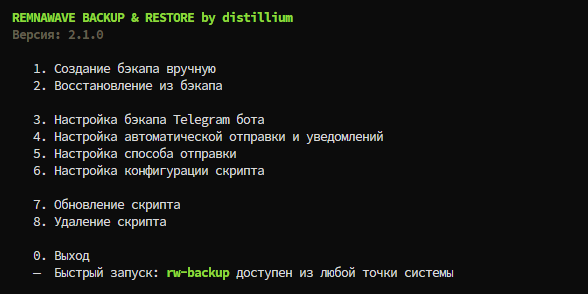

<p aling="center"><a href="https://github.com/distillium/remnawave-backup-restore">
 <picture>
   <source media="(prefers-color-scheme: dark)" srcset="./media/logo.png" />
   <source media="(prefers-color-scheme: light)" srcset="./media/logo-black.png" />
   
 </picture>
</a></p>

[🇬🇧 English](README.md) | **🇷🇺 Русский**

> [!CAUTION]
> **СКРИПТ ВЫПОЛНЯЕТ РЕЗЕРВНОЕ КОПИРОВАНИЕ И ВОССТАНОВЛЕНИЕ ВСЕЙ ДИРЕКТОРИИ И БАЗЫ ДАННЫХ REMNAWAVE, А ТАКЖЕ (ОПЦИОНАЛЬНО) TELEGRAM SHOP. РЕЗЕРВНОЕ КОПИРОВАНИЕ И ВОССТАНОВЛЕНИЕ ЛЮБЫХ ДРУГИХ СЕРВИСОВ И КОНФИГУРАЦИЙ ПОЛНОСТЬЮ НАХОДЯТСЯ В ЗОНЕ ОТВЕТСТВЕННОСТИ ПОЛЬЗОВАТЕЛЯ. РЕКОМЕНДУЕТСЯ ВНИМАТЕЛЬНО СЛЕДОВАТЬ ИНСТРУКЦИЯМ ПО ХОДУ ВЫПОЛНЕНИЯ СКРИПТА ПЕРЕД ВЫПОЛНЕНИЕМ ЛЮБЫХ КОМАНД.**

<details>
<summary>🌌 Предпросмотр главного меню</summary>


</details>

## Функции:
- интерактивное меню
- создание бэкапа вручную и автоматически по расписанию
- возможность бэкапа/восстановления в режимах панель+бот, только панель и только бот
- поддержка внешней PostgreSQL
- уведомления напрямую в Telegram бота или в топик группы с прикрепленным бэкапом
- уведомления об актуальной версии скрипта
- проверка размера бэкапа перед отправкой в TG и уведомление о превышении лимита
- отправка бекапа в Google Drive или S3 Storage (опционально)
- настраиваемая политика хранения бэкапов на сервере и S3 в отдельности

## Дополнительные инструкции для методов миграции:

<details>
  <summary>📝 Только панель: переход на новый сервер</summary>
  
- отредактировать в Cloudflare  поддомен панели на новый IP-адрес. А также поддомены остальных сервисов, если они будут размещены на новом сервере
- произвести восстановление директории и БД
- самостоятельно восстановить сертификаты для домена (если требуется)
- ссылка доступа и пароль будут от старой панели, с которой ранее делался бэкап
- удалить старое правило для сервисного порта (по умолчанию 2222) на всех нодах и создать новое. Это нужно для того, чтобы панель с новым IP-адресом смогла общаться с ними. Выполните команду на каждой ноде, предварительно заменив `OLD_IP` и `NEW_IP` на свои:

```bash
ufw delete allow from OLD_IP to any port 2222 && ufw allow from NEW_IP to any port 2222
```

- вы великолепны! Остается доустановить и настроить остальные нужные Вам сервисы (например kuma, beszel и прочее)

</details>

<details>
  <summary>📝 Панель+нода: переход на новый сервер</summary>
  
- отредактировать в Cloudflare  поддомены панели и "корневой" ноды (которая стоит вместе с панелью) на новый IP-адрес. А также поддомены остальных сервисов, если они будут размещены на новом сервере
- самостоятельно восстановить сертификаты для домена (если требуется)
- произвести восстановление директории и БД
- включить доступ к панели через порт 8443 (скрипт от eGames, пункт «Управление доступом к панели»)
- ссылка доступа и пароль будут от старой панели, с которой ранее делался бэкап
- в управлении нодами найдите корневую, которая стоит вместе с панелью. В ней указан адрес старого сервера. Измените его на новый - нода активируется автоматически
- теперь закрываем доступ к панели через порт 8443 тем же образом, как открывали
- удалить старое правило для сервисного порта (по умолчанию 2222) на всех внешних нодах и создать новое. Это нужно для того, чтобы панель с новым IP-адресом смогла общаться с ними. Выполните команду на каждой ноде, предварительно заменив `OLD_IP` и `NEW_IP` на свои:

```bash
ufw delete allow from OLD_IP to any port 2222 && ufw allow from NEW_IP to any port 2222
```

- вы великолепны! Остается доустановить и настроить остальные нужные Вам сервисы (например kuma, beszel и прочее)

</details>

<details>
  <summary>📝 Панель+нода: переход на "Только панель", на текущем сервере</summary>
  
- произвести восстановление директории и БД
- ссылка доступа и пароль будут от старой панели, с которой ранее делался бэкап
- удалить старую "корневую" ноду из панели и связанные с ней инбаунд и хост
- удалить файл `.env-node` с сервера панели командой:
  
```bash
rm /opt/remnawave/.env-node
```

- вы великолепны! Остается доустановить и настроить остальные нужные Вам сервисы (например kuma, beszel и прочее)

</details>

<details>
  <summary>📝 Панель+нода: переход на "Только панель", на новый сервер</summary>

- отредактировать в Cloudflare  поддомены панели на новый IP-адрес. А также поддомены остальных сервисов, если они будут размещены на новом сервере
- самостоятельно восстановить сертификаты для домена (если требуется)
- произвести восстановление директории и БД
- ссылка доступа и пароль будут от старой панели, с которой ранее делался бэкап
- удалить старую "корневую" ноду из панели и связанные с ней инбаунд и хост
- удалить файл `.env-node` с сервера панели командой:
  
```bash
rm /opt/remnawave/.env-node
```

- удалить старое правило для сервисного порта (по умолчанию 2222) на всех нодах и создать новое. Это нужно для того, чтобы панель с новым IP-адресом смогла общаться с нодами. Выполните команду на каждой ноде, предварительно заменив `OLD_IP` и `NEW_IP` на свои:

```bash
ufw delete allow from OLD_IP to any port 2222 && ufw allow from NEW_IP to any port 2222
```

- вы великолепны! Остается доустановить и настроить остальные нужные Вам сервисы (например kuma, beszel и прочее)
  
</details>

## Установка (требует root):

```
curl -o ~/backup-restore.sh https://raw.githubusercontent.com/distillium/remnawave-backup-restore/main/backup-restore.sh && chmod +x ~/backup-restore.sh && ~/backup-restore.sh
```
## Команды:
- `rw-backup` — быстрый доступ в меню из любой точки системы

<div align="center">

## 💎 Поддержать проект

<br>

<table>
  <thead>
    <tr>
      <th width="120">Сеть</th>
      <th width="480">Адрес USDT</th>
    </tr>
  </thead>
  <tbody>
    <tr>
      <td align="center"><b>BSC</b></td>
      <td><code>0x8b91f0c1ad7d03aa2427c342db81e3aee04b12a5</code></td>
    </tr>
    <tr>
      <td align="center"><b>TRON</b></td>
      <td><code>TEB6RzsH15qkguYWCCCeHDTKUEVE2qSEH2</code></td>
    </tr>
    <tr>
      <td align="center"><b>TON</b></td>
      <td><code>UQD2br2gNfuFEfK4uiki78bxFCiPdN7OLYqZ6EHkNtivemQ1</code></td>
    </tr>
    <tr>
      <td align="center"><b>SOL</b></td>
      <td><code>Hieo9WK2oTcURmkXj1WAccBSRzSDsuLyvs4s5jH7C6kS</code></td>
    </tr>
  </tbody>
</table>

<br>


 Спасибо за вашу поддержку! 🙏

<br>

</div>
